# Bookalator wireframes

## Author views

### Single author

#### Components

* author card
    * author photo thumbnail
    * author metadata block
* book cards container
    * book card
        * book cover thumbnail
        * book metadata block

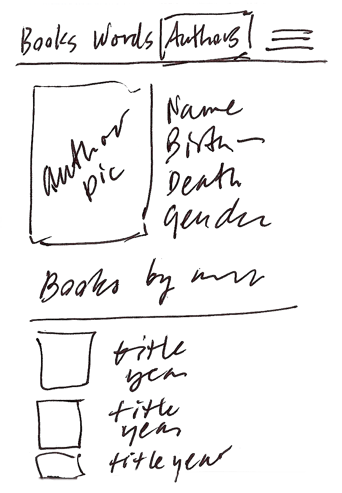

### Author cards

#### Components

* format picker: table, cards
* sort picker: name, birthYear, deathYear
* author cards container
    * author photo thumbnail
    * author metadata block

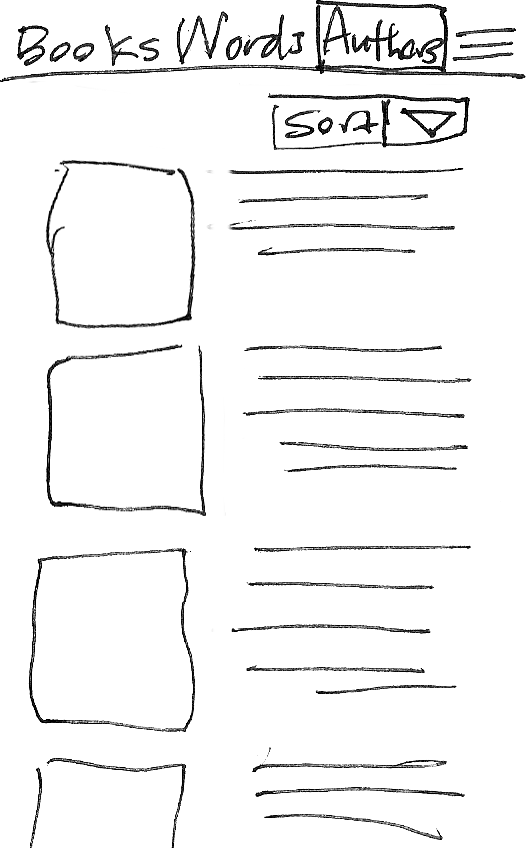

### Author table

#### Components

* format picker: table, cards
* author table: name, birthYear, deathYear, pronoun

#### Notes

* Table headings should be clickable to allow sorting.
* It would be nice to have a filter box at the top of each table column.

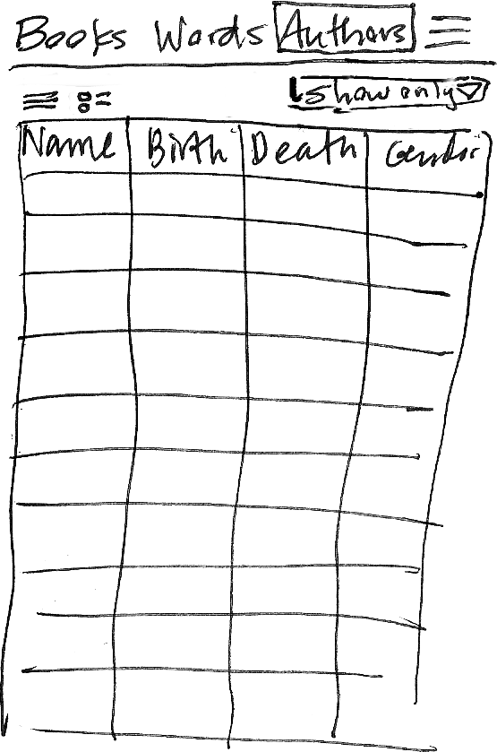

## Book views

### Single book

#### Components

* book picker dropdowns (left and right, options sorted alpha by Author.lastName, Author.firstName, Book.title)
* left book card (default: 1st book in the picker)
    * left book cover thumbnail
    * left book metadata block (collapsible)
* right book card
    * right book placeholder
* word table: left book word counts, left book words

#### Notes

* Table headings should be clickable to allow sorting.

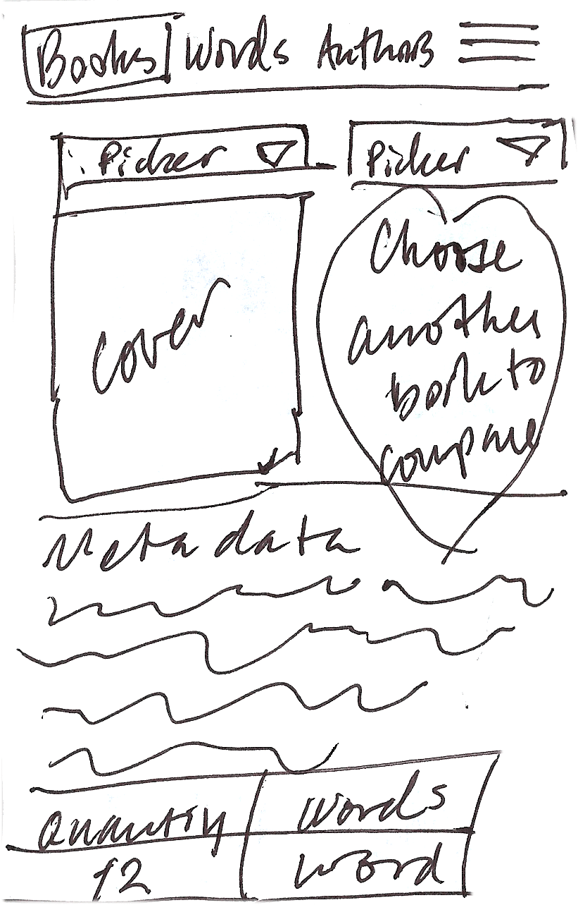

### Book comparison

#### Components

* book picker dropdowns (left and right, options sorted alpha by Author.lastName, Author.firstName, Book.title)
* left book card (default: 1st book in the picker)
    * left book cover thumbnail
    * left book metadata block (collapsible; the whole metadata block for both books opens and closes at once, not one side at a time)
* right book card
    * right book cover thumbnail
    * right book metadata block (collapsible)
* word table: left book word counts, both books’ words, right book word counts

#### Notes

* Table headings should be clickable to allow sorting.
* Clicking on a word count shows Word-in-book view for whichever book’s count was clicked.
* Clicking on a word count shows the single-word view.

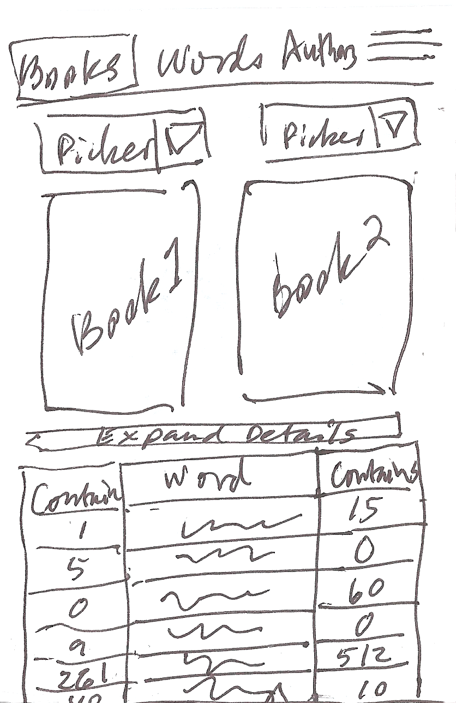

### Word in book

#### Components

* Word in _Book.title_ header
* Word metadata
* Example sentences (only from the current book)
* Link to see all examples (single word view)

#### Notes

* Selected word is highlighted in each example sentence.

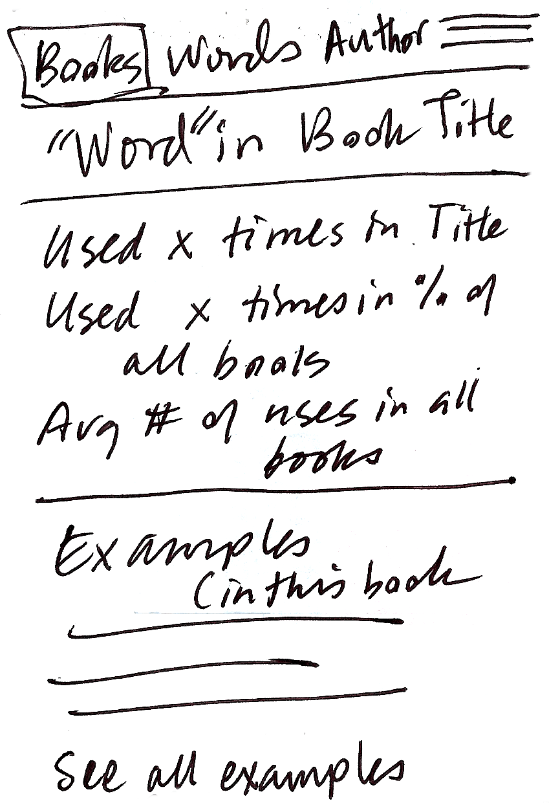

### Book cards

#### Components

* format picker: table, cards
* sort picker: author (lastName, firstName), title, year, wordCount, uniqueCount
* book cards container
    * book cover thumbnail
    * book metadata block

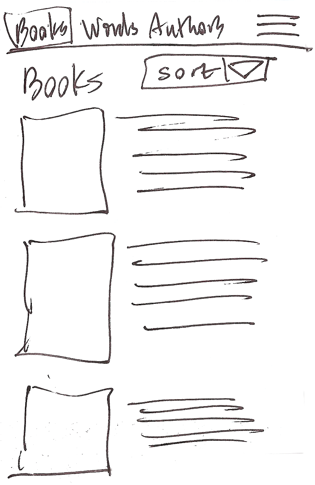

### Book table

#### Components

* format picker: table, cards
* book table: author (lastName, firstName), title, year, wordCount, uniqueCount

#### Notes

* Table headings should be clickable to allow sorting.
* It would be nice to have a filter box at the top of each table column.

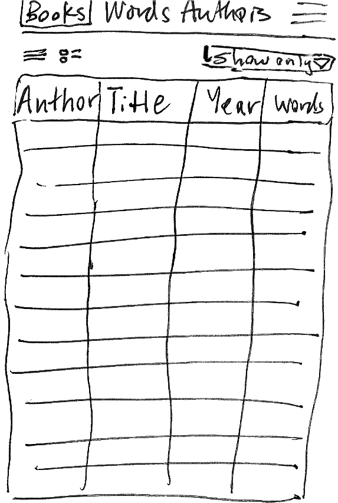

## Word views

### Single word

#### Components

* Word header
* Word metadata
* Example sentences, with linked title of source book

#### Notes

* Selected word is highlighted in each example sentence.

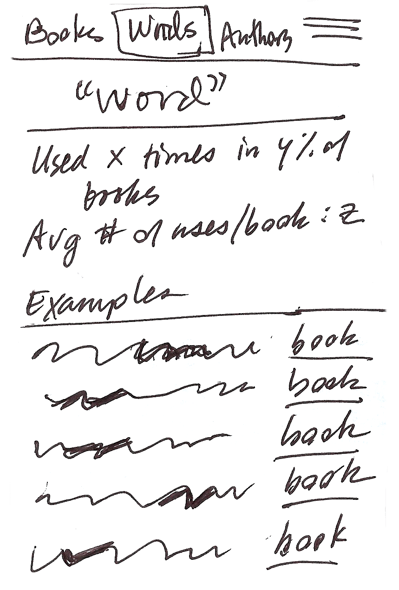

### Word table

#### Components

* word table: word, count (across all books), % of books containing the word

#### Notes

* Table headings should be clickable to allow sorting.
* It would be nice to have a filter box at the top of each table column.

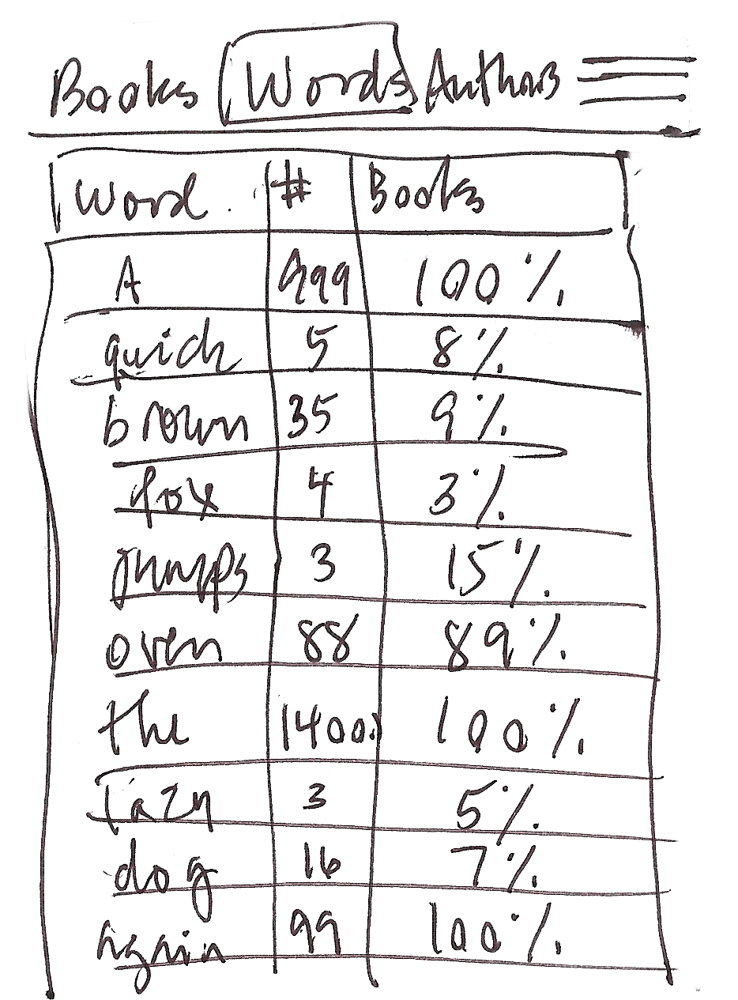

## Navigational components

### Navbar

#### Components

* Left side: Books, Words, Authors
* Right side: hamburger menu

### Hamburger menu

#### Notes

* Overlays whatever is currently on the screen.
* Clicking the menu button again closes it.
* Options: About, Credits, GitHub

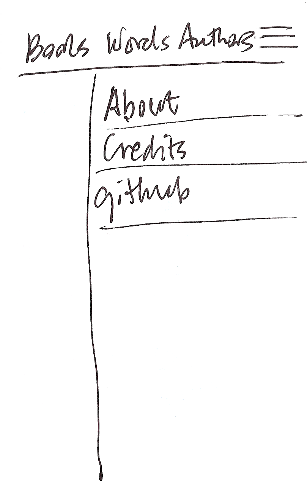

## Static pages

### About

### Credits

